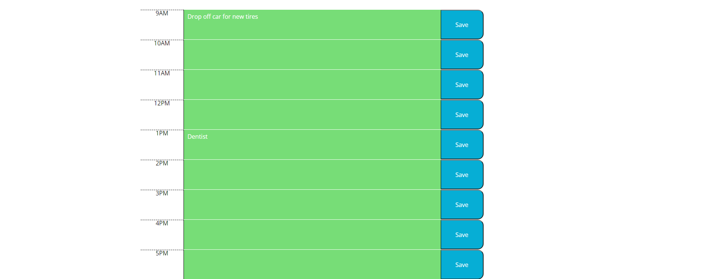

# work-day-scheduler

calendar application that allows a user to save events for each hour of the day. All data is stored in local storage.

# link

https://masonnewell.github.io/work-day-scheduler/

# screenshot

